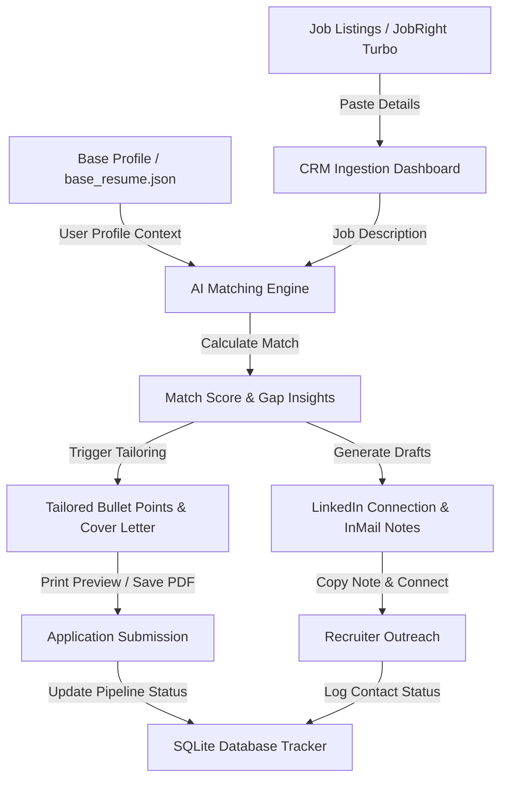

# 🎯 Job Search CRM & AI Application Tailoring Command Center

This is a personal job placement command center designed to automate, tailor, and track your job application process. You can check my personal live pipeline at: https://job-search-crm.onrender.com.

It operates locally as a FastAPI web dashboard and SQLite database. By loading your candidate profile and pasting any target job description, the system calculates a semantic compatibility match score, highlights keyword gaps, tailors your experience bullet points and cover letters, drafts recruiter outreach messages for LinkedIn (maximizing your LinkedIn Premium subscription), and tracks the status of each pipeline on a Kanban board.

---

## 🚀 Key Features

1. **Automated Profile Match Evaluation (LLM Scoring):** Calculates a semantic match score (0-100) and displays candidate strengths, gap analysis, and overlapping/missing skill lists.
2. **ATS Resume Optimization:** Rewrites experience bullet points to map directly to high-frequency keywords in the job description without fabricating facts.
3. **Tailored Cover Letter Generator:** Drafts a cohesive three-paragraph letter connecting your core projects (e.g., IoT telematics, credit risk models, tax compliance audits) to the specific problem statements of the hiring company.
4. **LinkedIn Recruiter Outreach Note builder:** Automatically drafts both under 300-character connection notes and InMail outreach templates.
5. **Interactive CRM Kanban Board:** Track pipelines visually across Ingested, Tailored, Applied, Interviewing, Offer, and Rejected stages.
6. **AI Recruiter Email Reply Routing:** Automatically checks your inbox via IMAP and routes applicant updates (Rejection ➔ `Rejected`, Interview invite ➔ `Interviewing`, Coding test / assessment ➔ `Needs Review`) using LLM classification.
7. **Automated Pipeline Funnel Chart:** Sleek analytics visual widget mapping conversion metrics from Ingestion through Offers.
8. **Stale Queue Auto-Pruning:** Auto-archives low compatibility matches (<60%) and inactive ingested posts (>5 days old) to keep the pipeline optimized.

---

## 🛠️ System Architecture



---

## 📂 Project Structure

```
Job-Search-CRM-Automation/
├── app/
│   ├── services/
│   │   ├── __init__.py
│   │   └── ai_service.py       # Handles OpenAI/Gemini matching and text rewriting
│   ├── templates/
│   │   ├── dashboard.html      # Principal Kanban board and ingestion layout
│   │   ├── job_detail.html     # Matching insights and copy-to-clipboard cards
│   │   ├── resume_print.html   # Print-ready clean A4 layout for PDF saving
│   │   └── cover_letter_print.html # Print-ready business letter layout
│   ├── static/
│   │   └── css/
│   │       └── style.css       # Premium cyber-dark style sheets
│   ├── __init__.py
│   ├── base_resume.json        # Base candidate profile details
│   ├── database.py             # SQLAlchemy configuration
│   ├── models.py               # JobApplication and TailoredDocument tables
│   └── main.py                 # FastAPI application routes
├── tests/
│   └── test_crm.py             # CRUD and AI integration unit tests
├── .gitignore
├── requirements.txt
└── README.md
```

---

## ⚙️ Quick Start

### 1. Configure Environment Variables
Create a `.env` file in the root folder:
```env
# Application
SECRET_KEY=your_app_secret_key_here
DATABASE_URL=sqlite:///./crm.db

# LLM API Config (OpenAI or Gemini compatibility endpoint)
OPENAI_API_KEY=your_gemini_api_key_here
OPENAI_MODEL=gemini-3.5-flash
OPENAI_API_BASE=https://generativelanguage.googleapis.com/v1beta/openai/

# SMTP Email Outreach Config (Optional for auto-emailing recruiters)
SMTP_USER=your_email@gmail.com
SMTP_PASSWORD=your_gmail_app_password
SMTP_SERVER=smtp.gmail.com
SMTP_PORT=587

# IMAP Email Status Tracker Config (Optional for auto-tracking replies)
IMAP_HOST=imap.gmail.com
IMAP_USER=your_email@gmail.com
IMAP_PASSWORD=your_gmail_app_password
```

### 2. Install and Run Locally
Using PowerShell:
```powershell
# Create virtual environment
python -m venv venv
.\venv\Scripts\activate

# Install requirements
pip install -r requirements.txt

# Start local server
uvicorn app.main:app --reload --port 8000
```
Open **[http://localhost:8000/](http://localhost:8000/)** in your browser.

### 3. Run Automated Email Status Monitor
To run the background task that checks your inbox periodically and routes recruiter replies:
```powershell
# Activate virtual environment
.\venv\Scripts\activate

# Run email monitor script
python -m app.services.email_monitor
```

